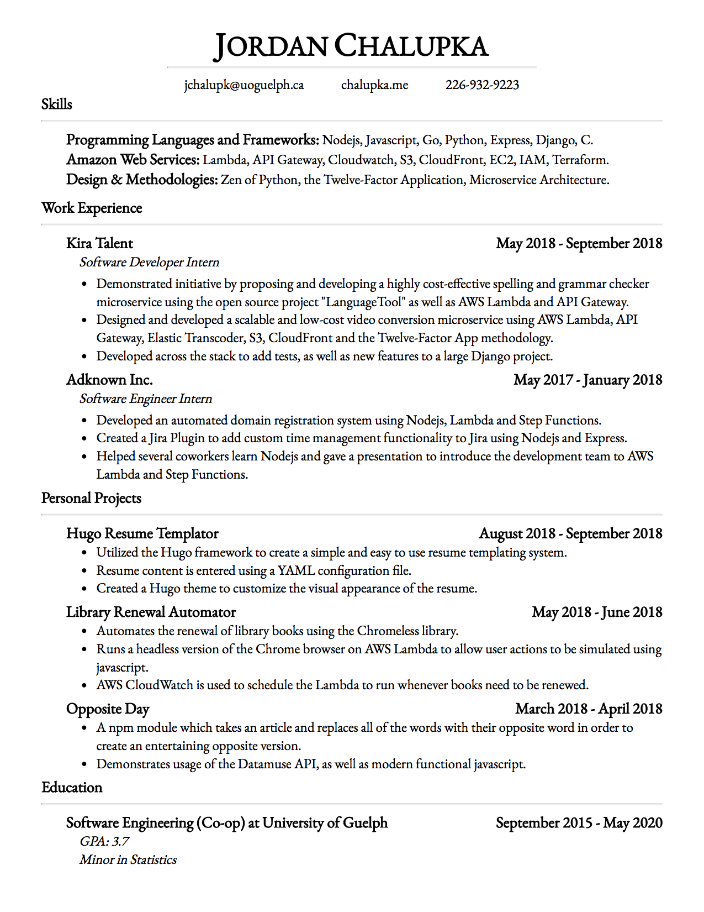

# Hugo Resume Template

## Overview
Uses a markdown file to create an easily custimizable resume.




## Getting Started

To run a development server use the command:
```
hugo server -D --watch
```

To build the site use the command:
```
hugo
```